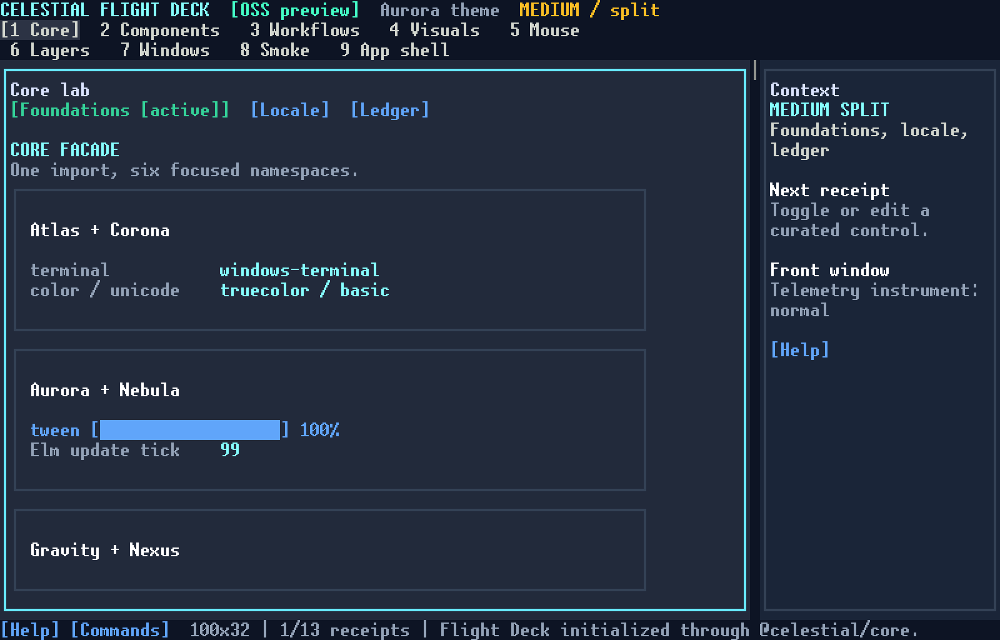

# Celestial

[](https://github.com/Sokoliem/celestial-oss/actions/workflows/ci.yml)
[](https://www.npmjs.com/package/@celestial/core)
[](https://nodejs.org)
[](LICENSE)

Celestial is a TypeScript framework for building state-driven terminal user interfaces. It combines an Elm-style runtime, Unicode-aware text handling, terminal capability detection, styling, animation, layout, mouse interaction, forms, Markdown, syntax highlighting, and charting behind a focused public package set. Views can be written as plain function calls or as TSX.

This repository is an **open-source preview**, not a 1.0 release. It contains a deliberately small, supported lane extracted from Celestial's broader research codebase.



*The Flight Deck demo, recorded deterministically from the framework's own renderer by [`scripts/record-demo.mjs`](scripts/record-demo.mjs).*

## Why Celestial?

If you're evaluating terminal UI frameworks, the honest comparison:

| | Celestial | Ink | Textual | Ratatui | Blessed |
| --- | --- | --- | --- | --- | --- |
| Language/runtime | TypeScript (Node 22+) | TypeScript (Node) | Python | Rust | JavaScript (unmaintained) |
| Programming model | Elm architecture, typed messages | React components | Reactive widgets | Immediate mode | Ad-hoc widgets |
| Declarative TSX | Yes (optional) | Yes (required) | No | No | No |
| Mouse support | First-class, contract-enforced | Limited/absent | First-class | Manual | Partial |
| Component library | 52 audited builders | Small set | Large set | Examples only | Large but stale |
| Window management | Splits, tabs, floating windows (beta) | No | Yes | No | Basic |
| Headless testing | Deterministic harness + PTY | Render to string | Snapshot testing | Backend swapping | None |
| Runtime dependencies | One (`zod`, forms only) | React + Yoga stack | Rich + Textual stack | Crate graph | Several |

What Celestial does that we haven't found elsewhere in one package:

- **An enforced interaction contract.** Every layered surface needs a visible close affordance and Escape dismissal; every interactive builder is exercised through both mouse and keyboard; the Flight Deck gates all 52 builders across nine themes at compact and wide widths with zero painted-audit violations.
- **Grapheme-safe everything.** Emoji, ZWJ sequences, CJK, and bidi text survive resize, clipping, and animation because width, wrapping, and hit-testing operate on grapheme clusters, not UTF-16 units.
- **Capability-driven degradation.** Atlas detects the terminal (Windows ConPTY included) and the framework falls back honestly — `NO_COLOR`, `TERM=dumb`, reduced motion, no-mouse — instead of spraying escape codes.
- **A testing story.** `createTestApp` gives deterministic headless interaction, snapshot audits of hit regions and contrast, and a real PTY harness for end-to-end runs on Linux, macOS, and Windows.

## Start a new app

The fastest on-ramp is the scaffolder — four templates, from a minimal counter to an agent-style assistant:

```bash
npm create celestial@latest my-app
cd my-app
pnpm install
pnpm dev
```

## Install into an existing app

Node.js 22 or newer is required.

```bash
pnpm add @celestial/core@preview @celestial/ui@preview
```

Add workflow and rich-output packages as the application needs them:

```bash
pnpm add @celestial/orbit@preview @celestial/pulsar@preview
pnpm add @celestial/spectrum@preview @celestial/mirage@preview @celestial/nova@preview @celestial/stellar@preview
```

Headless routing and modal-safe screen navigation are available separately:

```bash
pnpm add @celestial/compass@preview
```

Testing utilities are optional:

```bash
pnpm add -D @celestial/test@preview vitest
```

Horizon window management is available as a beta:

```bash
pnpm add @celestial/horizon@preview
```

Until the first npm preview is published, clone the repository and run one of the supported demos below.

## Quickstart

```typescript
import { app, Cmd, color, column, type Msg, style, Sub, text } from '@celestial/core';

interface Model {
  count: number;
}

type CounterMsg = Msg<'increment'> | Msg<'decrement'> | Msg<'quit'>;

const countStyle = style({ color: color.brightCyan, bold: true });

app<Model, CounterMsg>({
  init: () => [{ count: 0 }, Cmd.none()],

  update(message, model) {
    switch (message.type) {
      case 'increment':
        return [{ count: model.count + 1 }, Cmd.none()];
      case 'decrement':
        return [{ count: model.count - 1 }, Cmd.none()];
      case 'quit':
        return [model, Cmd.quit()];
    }
  },

  view: (model) =>
    column(
      text(`Count: ${model.count}`, countStyle),
      text('[+] increment  [-] decrement  [q] quit'),
    ),

  subscriptions: () =>
    Sub.batch<CounterMsg>(
      Sub.key('+', { type: 'increment' }),
      Sub.key('-', { type: 'decrement' }),
      Sub.key('q', { type: 'quit' }),
    ),
});
```

The programming model is always the same:

1. `init` creates the model and initial command.
2. `update` turns messages into a new model and commands.
3. `view` renders the model as a virtual terminal tree.
4. `subscriptions` describes keyboard, mouse, timer, focus, and other input.

The same architecture powers four supported, local-only demos:

| Demo | Command | What it exercises |
| --- | --- | --- |
| Task Console | `pnpm demo:tasks` | Real worker processes, streaming subscriptions, progress, cancellation, retry, responsive layout, and layered UI — [recording](docs/media/task-console.gif) |
| API Inspector | `pnpm demo:api` | Loopback HTTP, abortable commands, form controls, response tabs, history, and error states — [recording](docs/media/api-inspector.gif) |
| Horizon Workbench | `pnpm demo:horizon` | Beta splits, tabs, workspaces, responsive panes, managed floating windows, and window chrome — [recording](docs/media/horizon-workbench.gif) |
| Celestial Flight Deck | `pnpm demo:showcase` | A machine-backed tour of all 18 public packages and 52 curated builders, with Compass navigation, explicit Nebula config loading and diagnostics, Rosetta locale/bidi tools, deep Orbit and rich-output instruments, layered controls, context menus, and workspace-aware Horizon windows, shelf, snapping, tiling, and sessions |

All four demos import only the supported preview packages. They use bundled/local fixtures and never require credentials or an external service. The Flight Deck's detailed manual and automated acceptance path is in [`examples/celestial-showcase/README.md`](examples/celestial-showcase/README.md).

## Preview packages

| Package | Status | Purpose |
| --- | --- | --- |
| `@celestial/core` | Preview | The recommended entry point for Atlas, Corona, Aurora, Nebula, Gravity, and Nexus |
| `@celestial/atlas` | Preview | Terminal environment and capability detection |
| `@celestial/corona` | Preview | Colors, themes, tokens, borders, and text styling |
| `@celestial/aurora` | Preview | Tweens, springs, easing, and animation sequences |
| `@celestial/rosetta` | Preview | Grapheme segmentation, bidi-safe terminal text, localization, and formatting |
| `@celestial/nebula` | Preview | Elm runtime, virtual terminal DOM, commands, subscriptions, signals, focus, and explicit config loading with diagnostics |
| `@celestial/gravity` | Preview | Flex, grid, responsive, and spatial layout primitives |
| `@celestial/nexus` | Preview | Hit testing, mouse interaction, focus stacks, and pointer primitives |
| `@celestial/compass` | Preview | Local URLs, deterministic route matching, immutable history, headless routing, and modal-safe screen navigation |
| `@celestial/ui` | Preview | A curated set of 52 tested input, navigation, data, feedback, and contextual-surface builders |
| `@celestial/orbit` | Preview | Forms, validation, prompts, schema-driven fields, and branching wizards |
| `@celestial/spectrum` | Preview | State-machine syntax highlighting, language detection, and diagnostics |
| `@celestial/mirage` | Preview | Grapheme-safe gradients and reduced-motion-aware text effects |
| `@celestial/nova` | Preview | Composable, reduced-motion-aware view transitions |
| `@celestial/stellar` | Preview | Accessible sub-cell canvas, charts, dashboards, gestures, and static export |
| `@celestial/pulsar` | Preview | Unicode-aware Markdown parsing, rendering, search, overlays, and safe rich fences |
| `@celestial/test` | Preview | Headless app testing, queries, snapshots, Vitest matchers, and an optional PTY harness |
| `@celestial/horizon` | Beta | Splits, tabs, managed floating windows, workspace reassignment, lifecycle diagnostics, minimized taskbar, constraints, snapping, and persistence |

`@celestial/core` provides both a concise golden path and explicit subpaths such as `@celestial/core/nebula` and `@celestial/core/corona`. The six implementation packages remain usable for consumers who need their full APIs.

Tooling publishes alongside the framework packages: `create-celestial` (project scaffolder, `npm create celestial@latest`), the TSX layer (`jsxImportSource: "@celestial/core"`), the plugin-wired DevTools inspector (F12/Ctrl+D), and Node SEA / Bun single-binary bundlers (`pnpm bundle:sea`, `pnpm bundle:bun`) for shipping apps as standalone executables. The interactive documentation site lives at [sokoliem.github.io/celestial-oss](https://sokoliem.github.io/celestial-oss/) with framework-rendered component previews.

Guides: [Getting started](docs/guides/getting-started.md) · [Platform support](docs/guides/platform-support.md) · [Troubleshooting](docs/guides/troubleshooting.md)

## Curated UI

The preview publishes 52 builders instead of the full repository's experimental catalog:

- Input: `button`, `textInput`, `textarea`, `checkbox`, `radioGroup`, `select`, `toggle`, `slider`
- Grouped and assisted input: `checkboxGroup`, `toggleGroup`, `autocomplete`, `combobox`, `datePicker`, `multiSelect`, `numberInput`
- Specialized form controls: `rangeSlider`, `rating`, `segmentedControl`, `tagInput`, `colorPicker`, `formField`
- Navigation: `tabs`, `breadcrumb`, `pagination`, `commandPalette`, `optionListView`
- Data and display: `dataTable`, `tree`, `list`, `virtualList`, `scrollbar`, `progressBar`, `indeterminateProgress`, `spinner`, `card`, `cardGrid`, `divider`, `emptyState`
- Feedback: `badge`, `alert`, `statusBar`, `tooltip`, `createToastManager`
- Layers: `modal`, `confirmDialog`, `drawer`
- Context: `popover`, `popoverGroup`, `hovercard`
- AI and CLI primitives: `toolCall`, `diffViewer`, `inlinePrompt`

`contextMenuView`, `createNotificationCenter`, and their controlled
reducer/measurement helpers are public composition primitives rather than
component-owned stores. They are not counted as component builders. The
`createTextPromptApp`/`createSelectPromptApp`/`createConfirmPromptApp`
factories behind `inlinePrompt` are public testing and composition seams and
are likewise outside the builder count.

The public surface is mouse-aware, has keyboard fallbacks where appropriate, uses semantic theme tokens, reflows at narrow widths, and requires visible close affordances plus Escape dismissal for layered surfaces.

## Navigation, workflows, and rich output

`@celestial/compass` supplies dependency-free, headless route and screen models that applications can compose into their own Elm-style update loops. `@celestial/orbit` composes the curated UI controls into explicit form and wizard models. `@celestial/pulsar` renders Markdown and delegates syntax highlighting and validated chart fences to `@celestial/spectrum` and `@celestial/stellar`. `@celestial/mirage` and `@celestial/nova` honor reduced-motion settings, while the rendering stack uses grapheme-safe primitives so resize and animation operations do not split user-perceived characters.

The preview intentionally uses safe fallbacks: Pulsar does not fetch remote images or emit binary image protocols, and Mermaid fences remain readable source until the Canvas package is admitted to the public boundary.

## Testing

`@celestial/test` includes deterministic headless rendering and interaction helpers:

```typescript
import { createScreen, createTestApp } from '@celestial/test';

const handle = createTestApp(myApp, { cols: 80, rows: 24 });
const screen = createScreen(handle);

screen.fireMouse({ type: 'click', row: 2, col: 8 });
screen.getByText('Saved');
handle.stop();
```

Vitest matchers are installed through a separate opt-in entry:

```typescript
import '@celestial/test/vitest';
```

Real subprocess interaction is available through `@celestial/test/pty` when the optional `node-pty` peer dependency is installed.

## Horizon beta

Horizon is intentionally labeled beta. Its published runtime dependency closure is only `@celestial/core`, and its preview surface covers panes, workspaces, managed windows, the minimized shelf, bounded snap zones, recursive tiling, and serializable sessions. PTY embedding, Lens automation, and advanced cross-package transitions are not part of the beta API.

## Repository scope

This focused repository contains only the packages, tooling, and demos listed above. Exploratory work such as 3D and browser rendering, remote sharing, multiprocess orchestration, agent *runtime* tooling (protocols, transports, models), demoscene effects, and binary terminal images is developed separately. Agent-facing UI components (`toolCall`, `diffViewer`, `inlinePrompt`) and single-executable app bundling are in scope and ship here. Additional surfaces will be brought in selectively after their dependency boundary, tests, documentation, and release contract are ready.

See [`docs/preview-scope.md`](docs/preview-scope.md) for the exact boundary.

## Develop from source

```bash
git clone https://github.com/Sokoliem/celestial-oss.git
cd celestial-oss
corepack enable
pnpm install --frozen-lockfile
pnpm run preview:validate
pnpm demo:showcase
```

Useful commands:

```bash
pnpm run preview:boundary
pnpm run preview:licenses
pnpm run preview:lint
pnpm run preview:build
pnpm run preview:typecheck
pnpm run preview:test
pnpm run demos:test
pnpm run demos:test:pty
pnpm run preview:pack:check
```

## Stability

Preview versions can change APIs between releases. Only exports documented by the packages in this repository are supported.

Contributions should target the preview lane. Read [`CONTRIBUTING.md`](CONTRIBUTING.md) and [`SECURITY.md`](SECURITY.md) before opening a report.
Maintainers should use the [`preview release checklist`](docs/release-checklist.md) for changesets, validation, publication, and post-publish verification.

## License

MIT. See [`LICENSE`](LICENSE).
