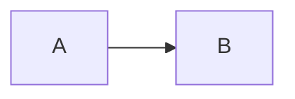

# @celestial/pulsar

Unicode-aware terminal Markdown parser and renderer for the Celestial TUI ecosystem. Pulsar combines CommonMark and GFM-oriented parsing, syntax highlighting, safe width-aware rendering, streaming snapshots, and Elm-architecture VNode composability.

## Installation

Celestial is pre-release and not published to npm yet. Clone the monorepo, run the root install flow in [`README.md`](../../README.md), then use this package from a workspace app or example inside the repo.

If you want to use the returned tree inside a Nebula app or annotate against Nebula's `VNode` type, that package is already available from the same workspace checkout.

## Features

- **Full Markdown** — Headings, paragraphs, lists, code blocks, tables, links, blockquotes, horizontal rules
- **GFM Extensions** — Task lists, admonitions, footnotes, emoji shortcodes, definition lists, details/summary, strikethrough, highlight marks
- **Safe Image Placeholders** — Preserve alt text and URLs without emitting unverified terminal image control sequences
- **Math Unicode** — LaTeX-to-unicode subset renderer for superscripts, subscripts, sqrt, fractions, and ~50 common symbols
- **Stellar Chart Fences** — Render validated line, bar, scatter, and stacked-bar JSON specs as braille charts
- **Diagram Fallbacks** — Preserve Mermaid source as syntax-highlighted code while Canvas remains outside the focused preview
- **Frontmatter** — Parse YAML, TOML, or JSON frontmatter safely (rejects unsafe `!!` tags)
- **Wiki-links** — Parse `[[Page]]` and `[[Page|alias]]` inline and as block tokens
- **Collapsed Admonitions** — `[!warning]+` (expanded) and `[!warning]-` (collapsed) with `collapsible` / `collapsed` flags
- **AI-native Admonitions** — `ai-thinking`, `tool-call`, `citation` kinds with themed colors and icons
- **Syntax Highlighting** — Grammar-based engine with 20+ languages and 5 named themes
- **ANSI-Preserving Word Wrap** — Wraps styled text correctly across line boundaries
- **Cross-Platform Input** — Normalizes LF, CRLF, and legacy carriage-return Markdown without parser stalls
- **Custom Themes** — Full theme system with semantic theme bridge and admonition overrides
- **OSC 8 Hyperlinks** — Terminal hyperlinks via `@celestial/nexus`
- **Bidi/RTL Support** — Unicode-aware text direction via `@celestial/rosetta`
- **VNode Integration** — Render markdown as nebula VNode tree for Elm-architecture apps
- **Interaction Tags** — Links, footnote refs, task toggles, and copy affordances carry `PulsarNodeData` so consumers can wire hitmaps without re-parsing
- **Streaming** — Incremental parsing for real-time markdown rendering with shimmer-ready token tracking
- **Overlay Rendering** — Compact, scrollable viewport rendering for overlays and previews
- **Performance Benchmarks** — Vitest bench harness for parse/render/stream budgets

## Usage

### Basic Rendering

```typescript
import { renderMarkdown } from '@celestial/pulsar';

const output = renderMarkdown(`
# Hello World

This is **bold** and *italic* text.

\`\`\`typescript
const greeting = 'Hello!';
console.log(greeting);
\`\`\`

- Item 1
- Item 2
- Item 3
`, { width: 80 });

console.log(output);
```

### As VNode (Nebula Integration)

```typescript
import { markdown } from '@celestial/pulsar';

const view = markdown('# Hello\n\nSome **bold** text.', { width: 80 });
```

`markdown()` returns plain VNode-shaped objects, so it can be passed directly into nebula view functions without adding a runtime dependency on `@celestial/nebula`.

### With Elm Architecture

```typescript
import { app, Cmd, Sub } from '@celestial/nebula';
import { markdown } from '@celestial/pulsar';

interface Model {
  content: string;
}

type AppMsg = { type: 'setContent'; content: string };

app<Model, AppMsg>({
  init: () => [{ content: '# Welcome\n\nHello **world**!' }, Cmd.none()],

  update: (msg, model) => {
    if (msg.type === 'setContent') {
      return [{ content: msg.content }, Cmd.none()];
    }
    return [model, Cmd.none()];
  },

  view: (model) => markdown(model.content, { width: 80 }),
});
```

### Inline Images

```typescript
import { renderMarkdown } from '@celestial/pulsar';

const md = '';

console.log(renderMarkdown(md, { width: 80 }));
```

The focused public preview always renders a styled placeholder. It never embeds fetched bytes or emits Kitty, Sixel, or iTerm image control sequences; consumers remain responsible for fetching and validating network assets.

### Math Unicode

```typescript
import { renderMarkdown, mathToUnicode } from '@celestial/pulsar';

const md = 'The energy equation is $E = mc^2$ and the fraction is $\\frac{1}{2}$.';

console.log(renderMarkdown(md, { mathRendering: 'unicode', width: 80 }));

// Or use the converter directly:
console.log(mathToUnicode('\\sqrt{x^2 + y^2}'));
```

### Mermaid Diagrams

````markdown

````

Mermaid fences intentionally fall back to syntax-highlighted source in the focused public preview because the full repository's Canvas parser is not part of the release boundary.

### Stellar Chart Fences

Register the built-in chart renderer for validated JSON chart specs:

```typescript
import { chartFenceRenderer, renderMarkdown } from '@celestial/pulsar';

const source = `\`\`\`chart
{"type":"bar","data":[3,7,4,9],"height":6}
\`\`\``;

console.log(renderMarkdown(source, {
  width: 48,
  fenceRenderers: { chart: chartFenceRenderer },
}));
```

Supported `type` values are `line`, `bar`, `scatter`, and `stacked-bar`. Requested chart widths are clamped to the current Markdown render width.

### Frontmatter

```typescript
import { extractFrontmatter, renderMarkdown } from '@celestial/pulsar';

const input = `---
title: Hello
tags: [foo, bar]
---
# Body`;

const { data, body } = extractFrontmatter(input);
// data = { title: 'Hello', tags: ['foo', 'bar'] }
// body = '# Body'

console.log(renderMarkdown(input)); // frontmatter token is emitted but renders as empty
```

Frontmatter supports YAML (`---`), TOML (`+++`), and JSON (`{...}`). YAML parsing rejects unsafe `!!` tags.

### Wiki-links

```markdown
See [[Getting Started]] for the basics.

Or use an alias: [[Internal Page|display text]].

A standalone wiki-link on its own line becomes a block token:

[[Home]]
```

### Collapsed Admonitions

```markdown
> [!warning]- Hidden by default
> This body is collapsed until expanded.

> [!note]+ Expanded by default
> This body is visible and can be collapsed.

> [!tip] Always visible
> Plain admonition with no collapse affordance.
```

### AI-native Admonitions

```markdown
> [!ai-thinking]
> Processing your request...

> [!tool-call]
> Calling search_index...

> [!citation]
> [1] Smith et al., 2024
```

### Custom Theme from Colors

```typescript
import { renderMarkdown, createMarkdownTheme } from '@celestial/pulsar';

const md = '# Themed\n\nCustom colors.';

const theme = createMarkdownTheme({
  heading: '#00ff88',
  bold: '#ffffff',
  italic: '#aaaaaa',
  code: '#ff8800',
  link: '#0088ff',
  quote: '#666666',
  list: '#ffffff',
});

const output = renderMarkdown(md, { theme });
```

### Semantic Theme Bridge

```typescript
import { fromSemanticTheme, renderMarkdown } from '@celestial/pulsar';
import type { SemanticTheme } from '@celestial/corona';

const md = '## Semantic\n\nStyled from your app theme.';
const mySemanticTheme = {} as SemanticTheme;

const theme = fromSemanticTheme(mySemanticTheme);
const output = renderMarkdown(md, { theme });
```

### Syntax Highlighting

```typescript
import { highlightCode, highlight } from '@celestial/pulsar';

const result = highlightCode('const x = 1;', {
  language: 'typescript',
  theme: 'monokai',
});

const result2 = highlight('def greet():\n  print("hi")', 'python', 'dracula');
```

### Streaming Markdown

```typescript
import { createMarkdownStream } from '@celestial/pulsar';

const stream = createMarkdownStream({ width: 80 });

let snapshot = stream.append('# Hello\n');
console.log(snapshot.rendered);

snapshot = stream.append('\nSome text.\n\n');
console.log(snapshot.rendered);

snapshot = stream.snapshot({ finalize: true });
console.log(snapshot.rendered);

stream.reset();
```

### Scrollable Overlays

```typescript
import { overlayRenderer } from '@celestial/pulsar/overlay';

const overlay = overlayRenderer({
  content: '# Help\n\nLine 1\n\nLine 2\n\nLine 3',
  maxWidth: 60,
  maxHeight: 12,
  style: {
    density: 'compact',
    lineHighlight: (line) => line === 1,
  },
});

overlay.scrollTo(2);
const vnode = overlay.vnode();
```

`overlayRenderer()` keeps a compact line cache for constrained overlays, exposes `scrollTo()`, and lets callers capture and restore the current anchor when the viewport changes size.

### GFM Extensions

```typescript
import { renderMarkdown } from '@celestial/pulsar';

const md = `
## Task List

- [x] Completed task
- [ ] Pending task
- Regular item

## Admonition

> [!NOTE] Important Info
> This is a note admonition with styled borders.

> [!WARNING]
> Be careful with this operation.

## Footnotes

Here is a claim[^1] with a reference.

[^1]: Source for the claim.

## Emoji

:rocket: Launch complete! :tada:

## Images


`;

console.log(renderMarkdown(md, { width: 80 }));
```

### OSC 8 Hyperlinks

```typescript
import { renderMarkdown } from '@celestial/pulsar';

const output = renderMarkdown('[Click here](https://example.com)', {
  hyperlinks: true,
});
```

### Custom Language Registration

```typescript
import { registerLanguage, highlight } from '@celestial/pulsar';

registerLanguage({
  name: 'hcl',
  aliases: ['terraform', 'tf'],
  keywords: ['resource', 'data', 'variable', 'output', 'module', 'provider', 'locals', 'terraform'],
  types: ['string', 'number', 'bool', 'list', 'map', 'set', 'object', 'tuple', 'any'],
  builtins: ['file', 'templatefile', 'jsonencode', 'yamlencode', 'lookup', 'merge', 'concat'],
  lineComment: '#',
  blockComment: ['/*', '*/'],
  stringDelimiters: ['"'],
  templateLiterals: true,
  operators: '=!<>&|',
});

const result = highlight('resource "aws_instance" "web" {}', 'hcl');
```

### Parsing Without Rendering

```typescript
import { parseMarkdown, parseInline } from '@celestial/pulsar';

const tokens = parseMarkdown('# Hello\n\nSome **bold** text.');
const inlines = parseInline('Some **bold** and *italic* text.');
```

### Interaction Wiring

```typescript
import { markdown, wireMarkdownInteractions } from '@celestial/pulsar';

const vnode = markdown('[Click me](https://example.com)');

const wired = wireMarkdownInteractions(vnode, {
  onLinkHover: (url, pos) => console.log('hover', url, pos),
  onLinkClick: (url) => console.log('click', url),
  onCopy: ({ code, language }) => console.log('copied', language),
});
```

`wireMarkdownInteractions` is a Phase 1.5 stub that returns the VNode unchanged. Phase 3 will ship the full hitmap wiring implementation.

## API Reference

### Core Functions

| Function | Description |
|----------|-------------|
| `renderMarkdown(text, opts?)` | Render markdown to an ANSI-styled string |
| `markdown(text, opts?)` | Render markdown as a nebula-compatible VNode tree |
| `parseMarkdown(text)` | Parse markdown into a `Token[]` AST |
| `parseInline(text)` | Parse inline markdown into `InlineToken[]` |
| `createMarkdownStream(opts?)` | Create a streaming markdown renderer |
| `overlayRenderer(config)` | Render markdown inside a compact, scrollable overlay viewport |
| `extractFrontmatter(input)` | Extract YAML/TOML/JSON frontmatter from markdown source |
| `mathToUnicode(latex)` | Convert a LaTeX subset to unicode characters |
| `renderImage(token, ctx, buffer?)` | Synchronous safe image-placeholder render |
| `renderImageAsync(token, ctx, buffer?)` | Promise-compatible safe image-placeholder render |
| `bestImageProtocol(caps)` | Select the best image protocol from terminal capabilities |
| `wireMarkdownInteractions(vnode, hooks?)` | Stub wiring for link hover / click / copy interactions |

### Peer Loader

| Function | Description |
|----------|-------------|
| `loadPeer('stellar')` | Compatibility loader for the public Stellar integration |
| `hasPeer('stellar')` | Check whether Stellar has been loaded through the compatibility API |
| `getPeerSync('stellar')` | Retrieve the loaded Stellar module through the compatibility API |

### Syntax Highlighting

| Function | Description |
|----------|-------------|
| `highlight(code, language, theme?)` | Highlight code with a language grammar |
| `highlightCode(code, { language, theme? })` | Highlight code (object options API) |
| `getHighlightTheme(name)` | Get a named highlight theme |
| `createHighlightTheme(overrides)` | Create a custom highlight theme |
| `registerLanguage(grammar)` | Register a custom language grammar |
| `getLanguageGrammar(name)` | Get a language grammar by name |
| `listLanguages()` | List all registered language names |

### Theme Functions

| Function | Description |
|----------|-------------|
| `defaultTheme()` | Get the default dark markdown theme |
| `lightTheme()` | Get a light-background-optimized theme |
| `createTheme(overrides)` | Create a theme from partial overrides |
| `createMarkdownTheme(colors)` | Create a theme from a simple color map |
| `fromSemanticTheme(theme)` | Bridge a corona `SemanticTheme` to `MarkdownTheme` |

### Types

```typescript
interface RenderOptions {
  width?: number;
  theme?: MarkdownTheme;
  indent?: number;
  hyperlinks?: boolean;
  onLink?: (url: string) => void;
  bidi?: boolean;
  imageDisplay?: 'auto' | 'inline' | 'placeholder';
  imageMaxHeight?: number;
  diagrams?: boolean | { mermaid?: boolean; graphviz?: boolean };
  mathRendering?: 'unicode' | 'image' | 'placeholder';
  capabilities?: TerminalCapabilities;
  streaming?: { shimmer?: boolean; partialHighlight?: boolean };
  viewMode?: 'outline' | 'summary' | 'full';
  searchHighlights?: readonly MarkdownSearchMatch[];
  reduceMotion?: boolean;
  screenReaderHints?: boolean;
  aiAdmonitionThemes?: Partial<Record<AdmonitionKind, AdmonitionThemeOverride>>;
  liveExec?: LiveExecHostHooks;
  telemetry?: TelemetrySink;
}

interface TerminalCapabilities {
  imageProtocol: 'kitty' | 'sixel' | 'iterm' | 'blocks' | 'braille' | 'none';
  hyperlinks: boolean;
  trueColor: boolean;
  reducedMotion: boolean;
  screenReader: boolean;
}

type Token =
  | { type: 'heading'; level: 1 | 2 | 3 | 4 | 5 | 6; content: InlineToken[]; id?: string }
  | { type: 'paragraph'; content: InlineToken[] }
  | { type: 'code-block'; language: string; content: string; meta?: CodeBlockMeta }
  | { type: 'blockquote'; content: Token[] }
  | { type: 'list'; ordered: boolean; items: ListItem[] }
  | { type: 'hr' }
  | { type: 'table'; headers: InlineToken[][]; rows: InlineToken[][][]; align?: TableAlign[] }
  | { type: 'admonition'; kind: AdmonitionKind; title: string; content: Token[]; collapsed?: boolean; collapsible?: boolean }
  | { type: 'footnote-def'; label: string; content: Token[] }
  | { type: 'image'; alt: string; url: string; title?: string }
  | { type: 'frontmatter'; format: 'yaml' | 'toml' | 'json'; raw: string; data: Record<string, unknown> }
  | { type: 'wiki-link-block'; target: string; alias?: string }
  | { type: 'live-exec'; language: string; source: string; meta?: LiveExecMeta }
  | { type: 'details'; summary: InlineToken[]; content: Token[] }
  | { type: 'definition-list'; items: DefinitionListItem[] }
  | { type: 'math-block'; content: string };

type InlineToken =
  | { type: 'text'; content: string }
  | { type: 'bold'; content: InlineToken[] }
  | { type: 'italic'; content: InlineToken[] }
  | { type: 'code'; content: string }
  | { type: 'link'; text: string; url: string }
  | { type: 'strikethrough'; content: InlineToken[] }
  | { type: 'footnote-ref'; label: string }
  | { type: 'emoji'; name: string; unicode: string }
  | { type: 'mark'; content: InlineToken[] }
  | { type: 'sup'; content: InlineToken[] }
  | { type: 'sub'; content: InlineToken[] }
  | { type: 'math-inline'; content: string }
  | { type: 'wiki-link'; target: string; alias?: string }
  | { type: 'image-inline'; alt: string; url: string; title?: string }
  | { type: 'hard-break' };

type AdmonitionKind =
  | 'note' | 'tip' | 'important' | 'warning' | 'caution'
  | 'ai-thinking' | 'tool-call' | 'citation';

interface CodeBlockMeta {
  showLineNumbers?: boolean;
  startLine?: number;
  highlightLines?: number[];
  diff?: boolean;
  copy?: boolean;
  view?: 'unified' | 'split';
  fold?: boolean | number;
  wraps?: 'none' | 'soft' | 'wrap';
}

interface MarkdownStreamSnapshot {
  source: string;
  committedSource: string;
  pendingSource: string;
  tokens: Token[];
  rendered: string;
}

interface MarkdownStream {
  append(chunk: string): MarkdownStreamSnapshot;
  reset(): MarkdownStreamSnapshot;
  snapshot(options?: { finalize?: boolean }): MarkdownStreamSnapshot;
}

interface HighlightTheme {
  name: string;
  keyword: (text: string) => string;
  string: (text: string) => string;
  comment: (text: string) => string;
  number: (text: string) => string;
  operator: (text: string) => string;
  type: (text: string) => string;
  function: (text: string) => string;
  variable: (text: string) => string;
  punctuation: (text: string) => string;
  builtin: (text: string) => string;
}

type HighlightThemeName = 'default' | 'monokai' | 'github' | 'dracula' | 'solarized';

interface LanguageGrammar {
  name: string;
  aliases?: string[];
  keywords: string[];
  types?: string[];
  builtins?: string[];
  lineComment: string | string[];
  blockComment?: [string, string];
  stringDelimiters?: string[];
  templateLiterals?: boolean;
  operators?: string;
}
```

### Behavior Notes

- `width` defaults to `80` for string rendering and streaming snapshots.
- `hyperlinks` enables OSC 8 links in string rendering, including wrapped paragraphs and table cells.
- `markdown()` returns VNode-shaped objects; interactive elements carry `data` tags (`PulsarNodeData`) so consumers can wire hitmaps without re-parsing.
- `bidi` currently applies to paragraph text in string rendering.
- Images and Mermaid diagrams use deterministic public-preview fallbacks: styled placeholders and syntax-highlighted source, respectively.
- Chart fences call the included `@celestial/stellar` dependency directly; consumers do not need to preload it.
- Frontmatter is emitted as a `frontmatter` token and renders as empty in string mode. Use `extractFrontmatter()` if you only need the metadata.

### Supported Languages

TypeScript, JavaScript, Python, Bash, Go, Rust, Ruby, Java, C, C++, C#, JSON, YAML, CSS, HTML, SQL, Dockerfile, PHP, Swift, Kotlin, Lua, TOML, Diff, Markdown.

Each language can be referenced by name or alias (e.g., `'ts'` for TypeScript, `'py'` for Python).

### Highlight Themes

| Theme | Description |
|-------|-------------|
| `default` | Terminal-native colors (cyan keywords, green strings) |
| `monokai` | Classic Monokai dark theme |
| `github` | GitHub light code theme |
| `dracula` | Dracula dark theme |
| `solarized` | Solarized color palette |

## Dependencies

| Package | Role | Required |
|---------|------|----------|
| `@celestial/aurora` | Spring motion for anchor and snap-scroll controllers | Yes |
| `@celestial/corona` | Styling, colors, semantic themes | Yes |
| `@celestial/nebula` | Overlay virtualization and VNode integration | Yes |
| `@celestial/nexus` | OSC 8 hyperlinks | Yes |
| `@celestial/rosetta` | Bidi/RTL text, grapheme support | Yes |
| `@celestial/spectrum` | Stateful syntax highlighting and language grammars | Yes |
| `@celestial/stellar` | Braille chart rendering for chart fences | Yes |

## License

MIT
